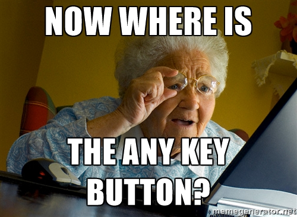
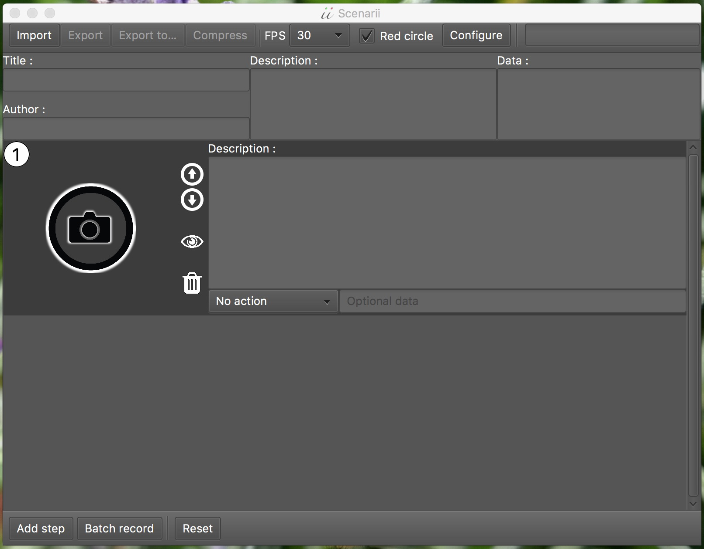

# This project is a work in progress
Expect some bugs. Issues and pull requestes are very welcome !

Require Java 8. Last stable can be found [here](target/scenarii-1.0-SNAPSHOT-jar-with-dependencies.jar).

# Scenarii
Be precise when you explain people how to do something on a computer, or you will end up with this situation :

A small cross-platform utility to record your screen as GIFs or quickly take screenshots. 
You can then commentate them, provide some data, compress the whole thing and mail it or publish it as an `.html` page.

Scenarii is especially useful for :
- testers to show developers how to reproduce a bug,
- people that need to explain step-by-step procedures,
- fast GIF screen record.

# How it works
Scenarii listen to keyboard shortcuts in the background, whatever application you are currently using.

Launch scenarii, you get this view:  

Don't play with all buttons right now and read on, this is important. If you decided to ignore my warning and  clicked everywhere, use the `ESC` key on your keyboard as much as needed.

Ok so, here you can : 
- `import` a scenario,
- `export` it to an `.html` file with images in a side folder,
- `export` it `to` another destination,
- `compress` the exported folder,
- select the framerate with `FPS`: 3, 6, 12, 18, 24 or 30 frames per seconds,
- enable/disable the `red circle` that display mouse/finger position on shot.

You can also, at the bottom :
- Add a step with `Add step`,
- generate a bunch of GIFs with `Batch record`,
- clear the view and `Reset` the whole thing.

## Take a screenshot
Simply press `Ctrl`+`Shift`+`C` or `Ctrl`+`Shift`+`P` in any application. 
It will add a step in Scenarii containing the screenshot. This shortcut will soon be customizable.

## Record a GIF

Add a step with `Add step` and click on the camera icon. A red rectangle show up around your cursor. You can resize it by holding down `Ctrl` and moving your mouse. Once you're ready, press `Alt` to start recording.
Once you're done, press `ESC` to stop recording. Your GIF will appear in place of the camera icon.

## Record a bunch of GIFs

If you want to generate a long sequence of actions, you can use `Batch record`. Every time you press `ESC` to stop recording, a new step will be created and you can directly press `Alt` to record again. If you want to exit batch record mode, just press `ESC` another time.

## Simple GIFs generation

You are not a tester, you don't care about steps description, data and all other stuff? You just want the `.gif` you generated? That's fine, just browse to `$HOME/scenarii-snaps/`. That's where scenarii stores his temporary files. If you want a clean named folder, just give your scenario a `title` and `export` it. Your $HOME folder might be `/home/you`, `C:\Users\you` or `/Users/you`. Beware ! Scenarii will empty `$HOME/scenarii-snaps/` when you close it.

## Descriptions

You can use markdown syntax in global and steps descriptions. See [the markdown syntax](https://github.com/adam-p/markdown-here/wiki/Markdown-Cheatsheet).

# Good practices

## Keep GIFs small and atomic

GIFs can become huge if you record a big area for a long time. To keep them small, resize your recording area and adjust the recording time accordingly.
It's perfectly fine to generate small but detailed steps with one short GIF for each step rather than a big GIF containing more than one information.
If it's still too big, you can use `compress` to try to gain some space.

## Use markdown to highlight ideas

Make your descriptions readable and easy to understand by creating lists, putting important words in bold, underline, italic, etc… remember to refer to 
[the markdown syntax](https://github.com/adam-p/markdown-here/wiki/Markdown-Cheatsheet).

# Shortcuts

Remember:
- `ESC` : stop and go back, press 2 times to exit a running batch record,
- `Ctrl` : resize the GIFs camera field of view,
- `Alt` : start recording,
- `Ctrl`+`Shift`+`C`, `Ctrl`+`Shift`+`P` : take an instant screenshot (soon customizable).

Scenarii is designed to record any kind of application, it's hard to pick neutral shortcuts as applications uses keyboard shortcuts too.
So to avoid triggering some unwanted behaviour in the recorded application, Scenarii use only the most neutral keys.

# Examples

Coming soon.

# Compatibility

Successfully tested on : 
- macOS 10.11.5 (El Capitan),
- Windows 8,
- Windows XP on a x86 processor.

# License
Coming soon.

